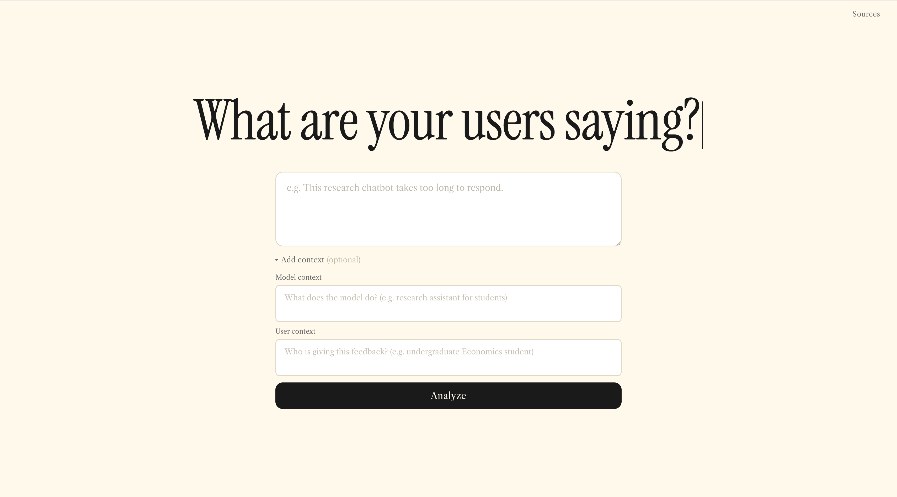
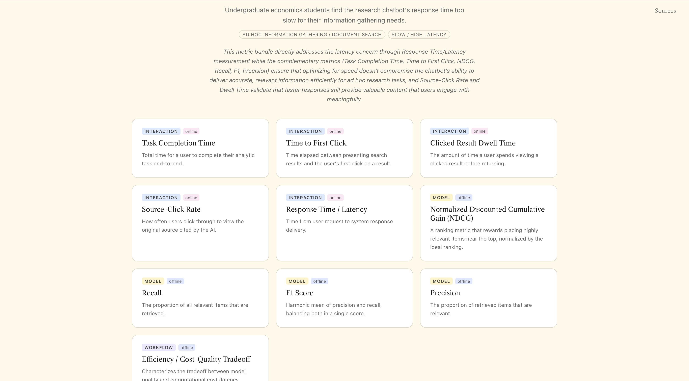
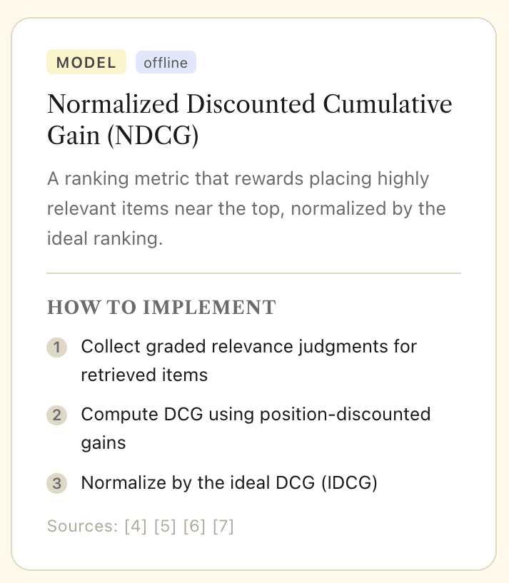
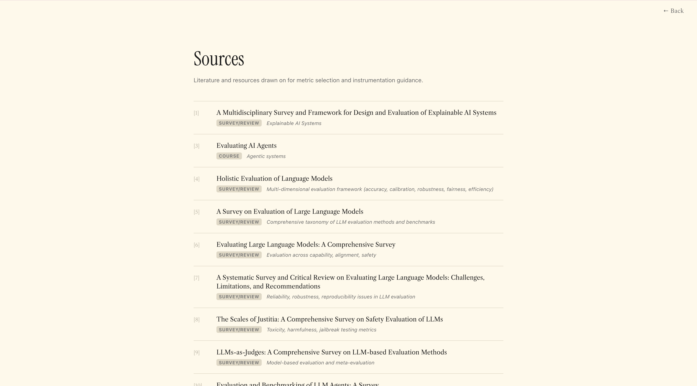

# EvalOps Assistant: Human-AI Workflow Evaluation Support

***Turning qualitative AI user feedback into measurable evaluation plans***

EvalOps Assistant is a Flask + Claude + Python prototype app that helps developers and product teams translate plain-language feedback about an AI system into structured evaluation guidance. Given feedback such as *“The chatbot is too slow and I don’t trust the answers,”* the assistant classifies the likely task and problem type and recommends relevant evaluation metrics and an instrumentation guide for each.

This project is part of my capstone contribution to the broader **EvalOps** research effort, a collaboration with the Laboratory for Analytic Sciences (LAS) focused on making evaluation continuous and grounded in stakeholder goals throughout the development of human-AI workflows.

---

## Why I Built This

AI systems often fail in ways that are difficult to diagnose from user feedback alone.

A user might say:

- “The system is too slow.”
- “I don’t trust this answer.”
- “The output is confusing.”
- “The chatbot gave me irrelevant information.”
- “I can’t tell where this claim came from.”

These complaints are useful, but they do not immediately tell a developer what to measure. A complaint about “trust,” for example, could point to hallucination, poor source grounding, weak explanation, low accuracy, bad interface design, or a mismatch between the task and the evaluation strategy.

EvalOps Assistant addresses that gap by helping teams move from:

```text
qualitative user complaint
        ↓
task + problem diagnosis
        ↓
recommended evaluation metrics
        ↓
instrumentation plan
```

The goal is not just to collect more data. The goal is to help teams ask the right evaluation questions earlier and connect user experience problems to concrete technical action.

---

## About the EvalOps Project

EvalOps is an evaluation-first design framework for human-AI workflows. It argues that evaluation should not be postponed until after a system is built. Instead, teams should define success criteria, collect stakeholder feedback, choose appropriate metrics, and revise systems continuously throughout development.

The broader EvalOps framework emphasizes:

- continuous evaluation,
- stakeholder-grounded design,
- task-to-metric alignment,
- traceable design decisions,
- lightweight feedback loops,
- and iterative refinement of AI-enabled tools.

My project contributes one practical piece of that larger vision: **a prototype assistant that helps teams select appropriate evaluation metrics based on user feedback.**

---

## What This Tool Does: Interface Walkthrough and Example Use Case

EvalOps Assistant takes qualitative feedback and optional context about the AI system and the user who produced the feedback, then returns a structured evaluation plan. The app is organized around a simple three-part workflow: input, recommendation, and source grounding. 

### 1. Landing / Input Page

Suppose a team is testing a RAG chatbot and receives this feedback:

```text
"This chatbot takes too long to respond!"
```

On the input page, the evaluator enters the feedback, optional model/system context, and optional user context. User context refers to the person or group the feedback came from, such as customers, analysts, students, support agents, or product users. This matters because the same complaint can imply different evaluation needs depending on what the system does and who is using it.

<p align="center">
  
</p>

### 2. Output Page: Summary + Metric Cards

After the feedback is submitted, the assistant classifies the likely task and problem type, summarizes the core issue, and recommends a bundle of evaluation metrics. In this example, the system identifies the task as ad hoc information gathering and the problem as latency.

<p align="center">
  
</p>

Each metric card expands upon hovering to explain what the metric measures and how it could be instrumented, helping teams move from a vague user complaint to a concrete evaluation plan. 

<p align="center">
  
</p>

The value of the tool is the **translation from vague feedback into an actionable evaluation plan:**

```text
What should we measure?
Why does that metric matter?
Where should we instrument the system?
Which part of the AI workflow might be failing?
```

### 3. Sources Page

The sources page shows the research grounding behind the metric taxonomy. This makes the recommendation process more transparent by connecting metric suggestions back to literature on AI evaluation, usability, and human-AI workflow assessment.

<p align="center">
  
</p>

---

## How It Works

The current prototype follows a four-step pipeline:

```text
1. Read feedback + optional model and user context
2. Classify task and problem type using Claude
3. Match relevant metrics using Python + JSON mappings
4. Output a metric bundle, instrumentation guide, and source links
```

### Step 1: Read feedback and context

The user enters natural-language feedback, plus optional context about what the AI system does and who produced the feedback.

### Step 2: Classify task and problem type

Claude classifies the feedback into predefined analytic task categories and problem categories. The model is constrained to use the taxonomy provided by the project rather than inventing new labels.

### Step 3: Match metrics through structured mappings

Python uses the Claude-generated classifications to look up relevant metrics through explicit JSON mappings.

This design intentionally separates:

- **LLM-based interpretation**, which is useful for messy language,
- from **rule-based metric selection**, which improves consistency and transparency.

### Step 4: Return metric cards and source grounding

The assistant displays recommended metrics with descriptions, evaluation modes, implementation guidance, and source links to the literature grounding behind each recommendation.

---

## System Architecture

The project is organized around a Flask-backed three-page web interface and a structured metric-recommendation backend.

```text
evalops-metric-assistant/
├── flask_app.py            # Flask routes for input page, analysis API, and sources page
├── templates/
│   ├── index.html          # Landing/input page and output container
│   └── sources.html        # Literature/source grounding page
├── static/
│   ├── app.js              # Front-end logic, API call, result rendering, metric cards
│   └── style.css           # Interface styling and responsive layout
├── llm_utils.py            # Claude classification + explanation generation
├── prompts.py              # JSON loading, metric matching, sanity rules
├── tasks.json              # Analytic task taxonomy
├── problems.json           # Problem taxonomy
├── metrics.json            # Evaluation metric database
├── mappings.json           # Task/problem-to-metric mappings
├── sources.json            # Literature/source metadata for metric grounding
├── requirements.txt        # Python dependencies
├── app.py                  # Legacy Streamlit prototype
└── README.md
```

### Core files

| File | Purpose |
|---|---|
| `flask_app.py` | Runs the Flask app, serves the main interface, exposes `/analyze`, and renders the sources page |
| `templates/index.html` | Defines the landing/input page, optional context fields, and output container |
| `templates/sources.html` | Renders the source list used to ground metric recommendations |
| `static/app.js` | Sends feedback/context to `/analyze`, renders summary chips, metric cards, and source links |
| `static/style.css` | Defines the visual design, layout, metric card styling, and sources page styling |
| `llm_utils.py` | Sends feedback to Claude for task/problem classification and bundle explanation |
| `prompts.py` | Loads JSON databases, matches metrics, deduplicates recommendations, and applies sanity rules |
| `tasks.json` | Defines supported analytic task categories |
| `problems.json` | Defines supported user/system problem types |
| `metrics.json` | Stores metric descriptions, types, modes, formulas, instrumentation steps, costs, burdens, and source IDs |
| `mappings.json` | Links task/problem classifications to recommended metrics |
| `sources.json` | Stores literature and resource metadata used by metric cards and the sources page |
| `app.py` | Older Streamlit prototype retained for reference; not the primary current interface |

---

## Taxonomy Design

A major part of this project was deciding how evaluation metrics should be organized so they could be recommended meaningfully.

The taxonomy is structured around three main ideas:

1. **What task is the AI system supporting?**
2. **What kind of problem is the user reporting?**
3. **Which metrics are most diagnostic for that task/problem pair?**

### Example task categories

```text
Ad hoc information gathering
Long-term tracking
Triage / classification
Sensemaking
Factual question answering
Report drafting
Verification
```

### Example problem categories

```text
Latency
Low trust
Irrelevant results
Information overload
Hard to verify
Hallucination
Poor coherence
Low accuracy
Poor usability
```

### Example metric types

The metric database includes interaction, model, survey, and workflow-level signals.

| Metric type | What it measures | Example metrics |
|---|---|---|
| Interaction | User behavior and workflow signals | response time, task completion time, source click rate |
| Model | Output quality and model behavior | accuracy, hallucination rate, RAG faithfulness, coherence |
| Survey | Human perception and experience | trust score, SUS, NASA-TLX |
| Workflow | System-level or deployment context | efficiency/cost tradeoff, agent observability, implementation readiness |

This structure reflects a central EvalOps idea: evaluation should be tied to the actual task, stakeholder goal, and workflow context rather than treated as a generic checklist.

---

## Reliability Design

One of the most important design choices in this project was combining LLM reasoning with traditional programming.

Claude is used for:

- interpreting messy natural-language feedback,
- classifying task and problem categories,
- generating short explanations.

Python is used for:

- loading structured taxonomies,
- matching metrics through predefined mappings,
- deduplicating recommendations,
- applying sanity checks,
- and enforcing fallback rules.

This hybrid design prevents the system from relying entirely on open-ended LLM judgment.

For example:

```text
If problem = latency
→ always include response_time

If problem = low_trust
→ always include trust_score

If task = verification
→ always include source_click_rate
```

These rules make the assistant more consistent and auditable than a fully prompt-only approach.

---

## How to Run

Clone the repository:

```bash
git clone https://github.com/tiffani3ng/evalops-metric-assistant.git
cd evalops-metric-assistant
```

Install dependencies:

```bash
python -m pip install -r requirements.txt
```

Create a `.env` file with your Anthropic API key:

```bash
ANTHROPIC_API_KEY=your_api_key_here
```

Run the Flask app:

```bash
python flask_app.py
```

Then open:

```text
http://127.0.0.1:8080
```

The main interface is served at `/`, metric recommendations are generated through `/analyze`, and literature sources are available at `/sources`.

---

## Evaluation Approach

This project is evaluated primarily as a proof of concept for operationalizing EvalOps at the level of everyday development decisions. The main evaluation questions are:

1. **Can qualitative user feedback be mapped to useful task/problem categories?**
2. **Can those categories produce a reasonable metric bundle?**
3. **Does adding model and user context improve recommendation quality?**
4. **Can the system explain why the recommended metrics address the feedback?**
5. **Can the assistant help teams move from vague complaint to concrete measurement plan?**

The current prototype shows that structured metric recommendation is possible, but further validation is needed to test whether the recommended metric bundles are actually the most useful ones for real AI development teams.

---

## v0.2 Additions

This fork extends the original prototype with a review-and-evolve loop, richer
problem metadata, a repo-aware analysis endpoint, and a real test suite. See
[`FLAGGED_FEEDBACK.md`](FLAGGED_FEEDBACK.md) for the full design notes.

### Flag-for-review queue

When the recommender's classification is weak (empty labels, thin metric
bundle, low-detail summary, or the model self-reports low confidence), the
feedback is appended to `flagged_feedback.jsonl` with the specific reason and
a stable uuid id. Severity is computed from the reasons; the model's own
confidence signal escalates uncertain cases to **high**.

| Route | Purpose |
|---|---|
| `GET /flagged` | HTML review queue with severity badges and "show reviewed" toggle |
| `GET /flagged/<id>` | Permalink view for a single entry (works even after it's marked reviewed) |
| `GET /flagged.json` | Programmatic dump including the reviewed-id list |
| `POST /flagged/<id>/review` | Mark an entry as reviewed |
| `POST /flagged/<id>/propose` | Attach a taxonomy-update proposal to an entry |

### Taxonomy update proposals + apply CLI

Each flagged entry exposes a "Propose taxonomy update" form (kind, suggested
id, label, keywords, tech_stack, nature, rationale). Proposals are
append-only to `taxonomy_suggestions.jsonl`. The end-to-end loop is closed
by `proposed_taxonomy.py`:

```bash
python proposed_taxonomy.py                       # writes proposed_taxonomy.md (markdown diff)
python proposed_taxonomy.py --apply <proposal_id> # commit a proposal to the taxonomy
python proposed_taxonomy.py --apply <id> --dry-run
```

`--apply` writes the new entry into `tasks.json` or `problems.json`, then
marks the proposal as `merged` in the suggestion log. Refuses unknown ids,
already-merged proposals, and id collisions.

### Problem categorization (tech stack + nature)

Each entry in `problems.json` now carries a `tech_stack` (`frontend`,
`backend`, `model`, `infra`, `mixed`) and a `nature` (`bug`, `design`,
`design+bug`). The `/analyze` response includes a
`classification.problem_categorizations` array, and the output UI shows
color-coded chips below the existing task/problem labels.

### `/analyze-repo` — repo-aware classification

`POST /analyze-repo` accepts `{feedback, repo_url}`, fetches a slice of the
public GitHub repo (top-level files only, capped at 10 files × 5KB each),
and asks the LLM where the issue likely originates. Returns
`{candidates: [{path, rationale}], verdict, tech_stack, summary}`. In
`DEV=true` mode returns a deterministic mock so the endpoint is exercisable
without network or LLM credentials.

### DEV mode

Setting `DEV=true` in `.env` swaps every LLM call for a deterministic mock:
keyword-based classification, canned bundle explanation, canned repo
analysis. No API key required to boot or use the app — handy for tests,
demos, and offline development.

### Test suite

`tests/` contains a pytest suite covering the flagging module, proposal
storage, the apply CLI, repo URL parsing + analysis, and the Flask routes.
Run it with:

```bash
pip install -r requirements-dev.txt
python -m pytest tests/
```

65 tests as of this fork; all hermetic (no network, no LLM calls).

---

## Limitations

This project has several important limitations:

- The taxonomy is still small relative to the full complexity of human-AI workflows.
- Metric matching is currently based on predefined mappings rather than learned retrieval.
- The system has not yet been validated with large-scale user studies.
- The current assistant recommends metrics but does not yet run those metrics automatically.
- The current prototype does not yet integrate with telemetry, logs, or evaluation platforms.
- The classification step depends on the quality of the task/problem taxonomy.
- The assistant does not yet support full traceability across design decisions, metric changes, and evaluation outcomes.

These limitations are expected for an MVP and point toward future work.

---

## Future Work

Future versions could extend the project in several directions:

### 1. Expand the metric database

Add more metrics, sources, domains, and implementation contexts.

### 2. Improve classification flexibility

Move beyond fixed taxonomy mappings toward embedding-based retrieval or hybrid retrieval over task, problem, and metric descriptions.

### 3. Add validation studies

Test whether the assistant’s metric recommendations improve real evaluation planning and debugging for AI systems.

### 4. Integrate telemetry

Connect recommended metrics to logs, traces, surveys, or instrumentation platforms.

### 5. Add editable classifications

Allow users to revise the assistant’s task/problem interpretation and regenerate recommendations.

### 6. Expand source-linked metric cards

Add citation previews, source excerpts, metric-specific rationale, and examples of how each source supports the recommendation.

### 7. Support continuous evaluation workflows

Track how feedback, metrics, design choices, and results evolve over time.

### 8. Connect metrics to business objectives

Map technical and user-experience metrics to broader operational goals such as adoption, trust, productivity, risk reduction, and decision quality.

---

## Why This Matters

As AI systems become more common in real workflows, teams need better ways to evaluate whether those systems are actually helping users. Traditional model evaluation often focuses on isolated technical performance. EvalOps shifts attention toward the full human-AI workflow:

```text
Is the system useful?
Is it trustworthy?
Is it aligned with the task?
Is the output actionable?
Can users verify it?
What should developers measure next?
```

EvalOps Assistant contributes to this shift by helping teams translate user experience problems into measurable evaluation plans. It is a small prototype, but it reflects a larger principle: evaluation should be designed into AI systems from the start.

---

## Selected References

This project draws on research and technical work related to EvalOps, human-AI workflow evaluation, visualization design methods, and AI system instrumentation.

- Shrestha, Bijesh, et al. *Faster, Smarter, User-Aligned: EvalOps and the Future of Integrated Evaluation for the IC.* Laboratory for Analytic Sciences Technical Report, 2025.
- Shrestha, Bijesh, et al. “Evaluation-First Design for Data Visualization Interfaces.” *Proceedings of the 2026 CHI Conference on Human Factors in Computing Systems*, 2026.
- *Making Evaluation Actionable: Design Sheets for Evaluation-First Design Practice.* *Proceedings of the Eurographics Conference on Visualization*, 2026.
- Ding, Y., et al. “reVISit: Supporting Scalable Evaluation of Interactive Visualizations.” *IEEE VIS*, 2023.
- McKenna, S., et al. “Design Activity Framework for Visualization Design.” *IEEE Transactions on Visualization and Computer Graphics*, 2014.
- Oppermann, M., and Munzner, T. “Data-First Visualization Design Studies.” *BELIV*, 2020.

---

## Author

**Tiffanie Ng**  
Economics & Mathematics major, Scientific Computing concentration  
Kenyon College ’26  

Built as part of a Scientific Computing capstone project advised by Dr. R. Jordan Crouser, in collaboration with the broader EvalOps research effort involving LAS, WPI, UNC–Chapel Hill, and Kenyon College.

[LinkedIn](https://www.linkedin.com/in/tiffanie-ng)
